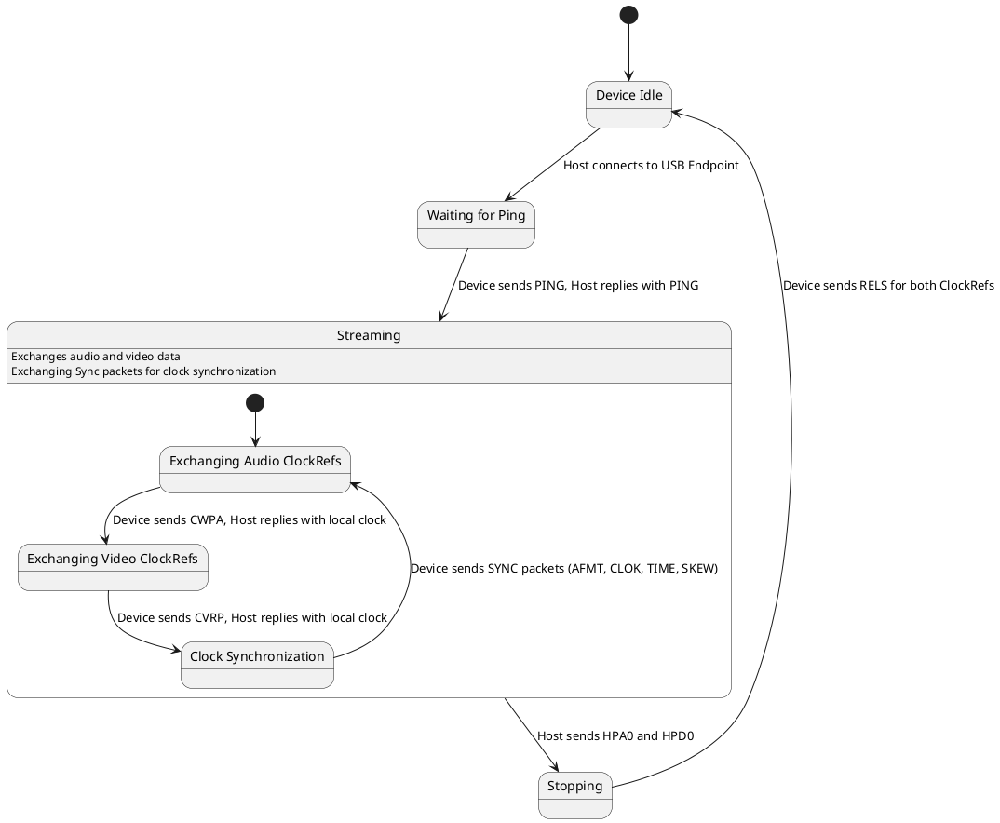

This diagram represents the state machine of the communication protocol between the host and the iOS device for screen mirroring. 

Here's a breakdown of the states:

* **Device Idle:** The initial state, where the device is not streaming.
* **Waiting for Ping:** Host has connected to the USB endpoint and is waiting for the initial ping from the device.
* **Streaming:** The active state where audio and video data are exchanged alongside synchronization messages. 
    * **Exchanging Audio ClockRefs:**  Host and device exchange clock references for audio synchronization.
    * **Exchanging Video ClockRefs:**  Host and device exchange clock references for video synchronization.
    * **Clock Synchronization:** Host and device exchange various SYNC packets (AFMT, CLOK, TIME, SKEW) for ongoing clock synchronization.
* **Stopping:** The host has initiated the shutdown by sending HPA0 and HPD0, waiting for the device to acknowledge and release resources.

The transitions indicate how the protocol moves between these states based on messages exchanged. 

This is a simplified representation, and the actual implementation may have more states or transitions to handle errors and corner cases. 
